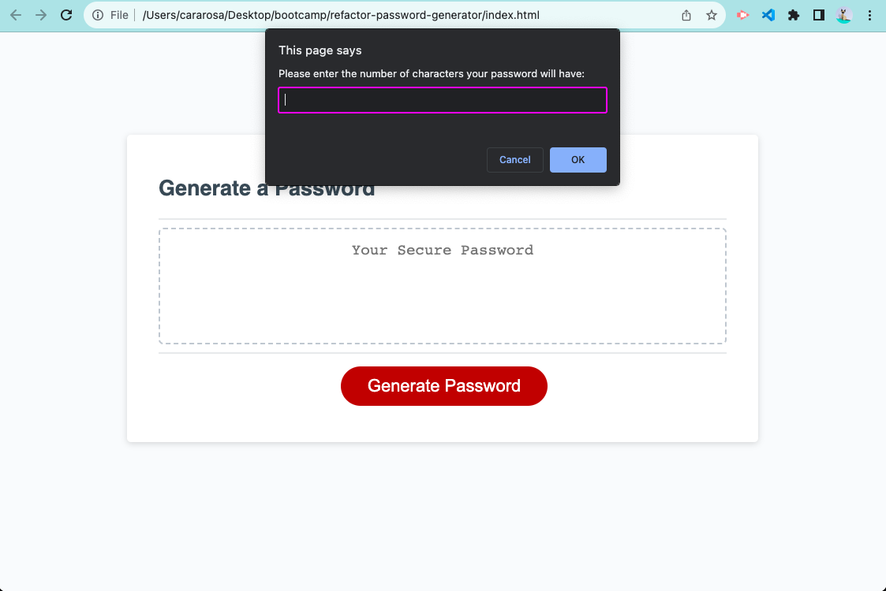

# Password Generator Website

## Description

The JavaScript Challenge is a webpage designed for users to randomly generate a password. Users follow specific criteria in order to make their own password. The criteria states that the length of the password is between 8-128 characters. If the password length is too short or too long, the user is re-directed to the initial prompt to ask how long the password will be. In addition, users can choose to include lowercase letters, uppercase letters, numbers, and special characters. A user must choose at least one of the latter criteria for their password. If they do not, they will be re-directed to start over again (ie. it will again prompt them to choose if they want a lowercase letter). Based off of the user’s selected criteria, it will generate a random password.

This project focuses on JavaScript to build the random password generator. Functions, arrays, loops, and if statements were utilized in order to complete this project. HTML and CSS have already been implemented for a well-structured and responsive design for users. The combination of JavaScript, HTML, and CSS allows a user to enjoy a website that is pleasing to the eye and functional (ie. allowing for different user choices to be made with a result).

## Installation

No installation is needed. Here is the link to the application: [Link]()

Below is an image of the website with the first prompt:

## Credits

My instructor helped to add the slice method to stop the code from outputting 36 characters for the password. He also helped to add code to randomize each if statement for the four criteria. I commented out the for loop according to his suggestion. After my tutoring session, I changed the code by deleting the slice method and the code for randomizing the if statements and adding back the for loop per my tutors suggestion.

## License

No license is necessary.
